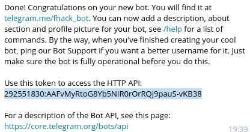

#Execute shell commands using a telegram bot

##Obtain a TOKEN
Open Telegram and search for @botfather, then start and send /newbot, complete all the steps and @botfather should have sent you a token, copy it.

### Create a conf.py

Create a conf.py and insert:
```
TOKEN = 'YOUR:TELEGRAMTOKEN'

```
